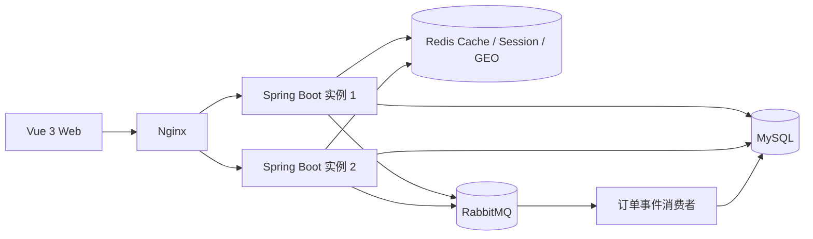

# 小众点评平台

小众点评是一个前后端分离的本地生活交易系统，围绕“发现商家—选择套餐—领取优惠—提交订单—获取券码—评价与邀请”构建完整业务闭环。项目采用模块化单体架构，重点实现交易一致性、缓存韧性、可靠消息、多实例会话和可观测性。

## 核心功能

- 用户：图形验证码注册、BCrypt 密码加密、Session 登录、退出登录和邀请码。
- 商家：关键词与拼音搜索、评分和价格筛选、商家详情、Redis GEO 附近检索。
- 套餐：商家套餐列表、套餐详情、库存与销量管理。
- 优惠券：新人券、满减、立减、折扣、秒杀、免单、自动选择最优优惠和原子核销。
- 订单：幂等下单、原子扣减库存、异步生成 16 位券码、订单查询和站内通知。
- 社区：商家评论、回复、评论奖励券、邀请记录及阶梯奖励。
- 运维：消息重试与死信补偿、请求追踪、结构化日志、限流、Actuator 指标和双实例故障转移。

## 系统架构



下单主链路由 MySQL 事务维护订单、库存、优惠券和 Outbox 事件。事务提交后发布订单事件，消费者异步完成券码生成、邀请奖励和站内通知；RabbitMQ 不可用时，定时任务继续投递 Outbox 中的未发送事件。

## 技术栈

| 层次 | 技术 |
| --- | --- |
| 后端 | Java 21、Spring Boot 3.4、Spring Security、Spring Data JPA、Spring Validation、Spring AMQP、Spring Actuator |
| 数据 | MySQL 8.4、Redis 7、RabbitMQ 3 |
| 前端 | Vue 3、Vue Router、Element Plus、Axios、QRCode.vue |
| 部署 | Docker Compose、Nginx、多阶段镜像构建 |
| 测试 | JUnit 5、Mockito、H2、Maven Surefire、PowerShell 冒烟压测脚本 |

## 一键启动

环境要求：Docker Desktop 或 Docker Engine，以及 Docker Compose v2。

```bash
git clone https://github.com/coder-shx/dianping.git
cd dianping
cp .env.example .env
docker compose up --build -d
```

Windows PowerShell 使用：

```powershell
Copy-Item .env.example .env
docker compose up --build -d
```

启动后访问：

- Web 页面：<http://localhost:8080>
- 健康检查：<http://localhost:8080/actuator/health>
- RabbitMQ 管理页面：<http://localhost:15672>

首次启动会写入 3 家演示商家和 4 个团购套餐。进入 Web 页面后即可注册账号，并依次体验新人优惠、商家检索、套餐下单、异步券码、订单通知、评论和邀请奖励。

`.env.example` 中的密码仅用于本地演示；在共享环境部署前应替换为独立强密码。

## 本地开发

启动 MySQL、Redis 和 RabbitMQ 后运行后端：

```powershell
cd backend
.\mvnw.cmd spring-boot:run
```

Linux 或 macOS 使用 `./mvnw spring-boot:run`。数据库连接、缓存和消息队列地址均可通过 `application.properties` 中对应的环境变量覆盖。

启动前端开发服务器：

```bash
cd frontend
npm ci
npm run serve
```

前端开发地址为 <http://localhost:8081>，开发服务器会将业务请求代理到 <http://localhost:8080>。

## 关键设计

### 交易一致性

- 客户端为每次下单生成幂等键，服务端通过“历史订单查询 + Redis 带租约锁 + MySQL 联合唯一索引”处理重复请求。
- 库存扣减使用库存条件和版本号进行单条原子更新；优惠券通过带剩余数量条件的更新完成核销。
- 金额统一使用 `BigDecimal` 和两位小数规则计算，订单价格以服务端数据库数据为准。

### 缓存与降级

- 商家和套餐详情采用 Cache-Aside，使用空值缓存、随机过期和写后失效处理常见缓存问题。
- Redis 查询异常时回退 MySQL，并使用 `Semaphore` 限制每个实例的数据库回退并发。
- 商家坐标写入 Redis GEO，支持按品类、半径和距离分页查询附近商家。

### 可靠消息

- 订单事务内写入 Outbox，提交后使用发布确认向 RabbitMQ 投递事件。
- 消费端使用消息唯一键保证幂等，异常消息经过 3 次有限重试后进入死信队列。
- 消费事务统一生成券码、处理邀请奖励并写入订单通知，成功提交后手动 ACK。

### 多实例与可观测性

- 两个后端实例共享 Redis Session，Nginx 负责负载均衡、连接超时和失败重试。
- 请求链路通过 `X-Request-Id` 关联，控制台输出 Logstash JSON 结构化日志。
- Actuator 暴露健康与指标数据，并记录 HTTP 分位数、缓存命中、Outbox 积压和死信积压。

## 主要接口

| 方法 | 路径 | 说明 |
| --- | --- | --- |
| `POST` | `/users` | 注册并建立登录 Session |
| `POST` | `/login` | 用户登录 |
| `POST` | `/logout` | 退出并销毁 Session |
| `GET` | `/api/businesses` | 商家筛选与排序 |
| `GET` | `/api/businesses/nearby` | 附近商家 GEO 查询 |
| `GET` | `/api/packages/{packageId}` | 套餐详情 |
| `GET` | `/api/coupons/all` | 当前用户优惠券 |
| `POST` | `/api/orders` | 幂等创建订单 |
| `GET` | `/api/orders/user` | 当前用户订单列表 |
| `GET` | `/api/orders/notifications` | 当前用户订单通知 |
| `POST` | `/api/reviews/add` | 新增评论或回复 |
| `GET` | `/api/invitation-records` | 当前用户邀请记录 |

## 验证

后端自动化测试：

```powershell
cd backend
.\mvnw.cmd test
```

前端生产构建：

```bash
cd frontend
npm ci
npm run build
```

启动 Docker Compose 后执行本地冒烟压测：

```powershell
powershell.exe -NoProfile -ExecutionPolicy Bypass -File .\scripts\smoke-load.ps1 -Requests 100 -Concurrency 10
```

测试覆盖金额边界、优惠券原子核销、库存为 1 时的并发扣减、Redis 锁所有权、Session 身份校验、注册后登录态、消息重复消费、Outbox 发布确认、有限重试和死信路由。

## 项目结构

```text
dianping/
├─ backend/                 Spring Boot 后端、实体、服务和测试
├─ frontend/                Vue 3 页面与前端构建配置
├─ nginx/                   前端镜像与反向代理配置
├─ scripts/                 冒烟压测脚本
├─ docker-compose.yml       MySQL、Redis、RabbitMQ、双后端与 Nginx 编排
└─ .env.example             本地环境变量示例
```

停止服务：

```bash
docker compose down
```

如需同时清除本地演示数据卷，可执行 `docker compose down -v`。
